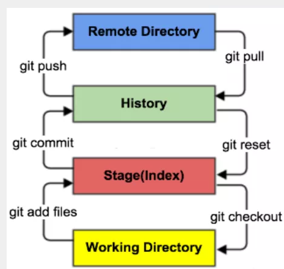

# 版本控制

* 主流版本控制器
  * Git
  * SVN
  * ....


## 版本控制

* 本地版本控制
* 集中版本控制 （SVN）

如：SVN，版本库需要放在**中央服务器**。

工作的时候，需要获取到最新的版本，写完代码以后需要把自己做完的内容推送到中央服务器。必须联网才能操作。

* 分布式版本控制 (Git)

每个人都有**全部代码**，所有版本的信息都会同步到本地的每个用户。可以离线在本地提交，在联网的时候push到相应的目标上即可。

好处：不会因为服务或者网络问题，造成不能工作。

# Git

## GIt的环境配置

官网:安装

Git安装后有三个程序

* Git Bash : Unix与Linux风格的命令行，比较推荐
* Git CMD：windows风格的命令行
* Git Gui： 不推荐初学者使用


* 查看用户全局配置文件

```
git config --global -l
```

* 查看系统配置文件

```
git config --system -l
```


* Git配置文件
  1) Git\etc\gitconfig **全局配置文件**
  2) C\user\当前用户\\.gitconfig  **用户配置文件**


* 全局配置用户

==设置用户名与邮箱==

```
git config --global user.name "oukGit"
git config --global user.email "fanxuwei@foxmail.com"
```


## Git基本理论

Git本地有三个工作区域：工作目录（Working Directory）、暂存区(Stage/Index)、资源库(Repository或Git Directory)。如果在加上远程的git仓库(Remote Directory)就可以分为四个工作区域。文件在这四个区域之间的转换关系如下：



- Workspace：工作区，就是你平时存放项目代码的地方
- Index / Stage：暂存区，用于临时存放你的改动，事实上它只是一个文件，保存即将提交到文件列表信息
- Repository：仓库区（或本地仓库），就是安全存放数据的位置，这里面有你提交到所有版本的数据。其中HEAD指向最新放入仓库的版本
- Remote：远程仓库，托管代码的服务器，可以简单的认为是你项目组中的一台电脑用于远程数据交换


## git常用命令


* `git init `给当前目录创建git仓库
* `git status` 查看当前状态
* `git add/rm [file]` 添加文件的改动/删除
* `git restore [file]`  从缓存区里还原文件置工作区
* `git log`查看历史版本
* `git reset` 还原版本
  * `git reset [config]  commitID ` 还原到对应的commitID版本
  * `git reset [config] HEAD^` 还原到上个版本 同理HEAD^^ 是上上个版本 HEAD^100 前100个版本
* `git `