# Spring Framework 系统架构

* Spring FrameWork 是Sping生态圈最基础的项目，是其他项目的根基

## 系统架构图

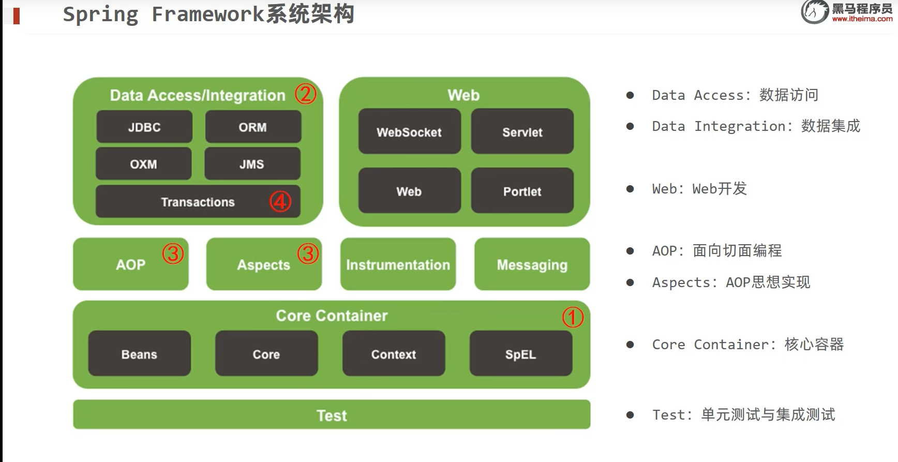	

## 学习路线

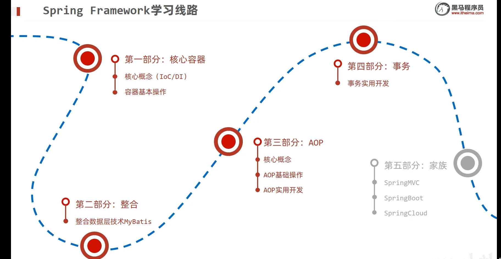

# Sping 核心概念的学习

* 代码书写现状

​	如果我们数据层需要修改，那么代码需要重新编译，发布，上线，比较麻烦。

​	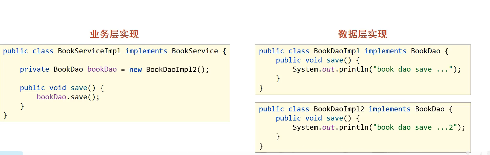


* 解决方案

​	使用对象的时候，不主动new提供对象，利用外部提供对象，下图只声明，不new对象。

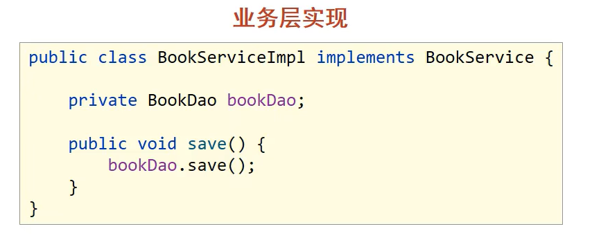

* 控制反转

  控制反转是对象的创建权转移到**外部**的一种思想。,平时我们用代码new来创建对象，如果把new的方式交给容器管理，那么这个就叫做控制反转。

* IOC容器 

  Spring提供了IoC容器，用来充当IoC思想中的外部，被管理的对象在Ioc容器中统称为**Bean**。可以绑定好Bean对象，让其不会缺少其他对象而无法运行。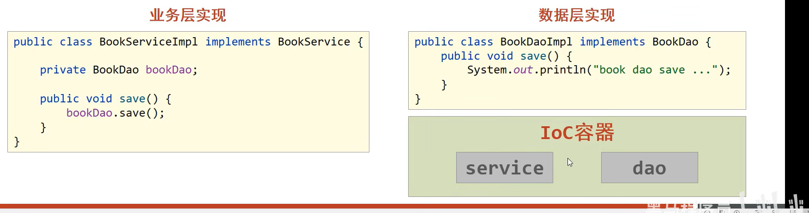


* DI依赖注入

  在容器中建立bean与bean之间依赖关系过程，称为依赖注入。


# Ioc入门案例分析

* IoC管理的是：Service与Dao
* 用配置的方式告知IoC容器管理哪些对象
* 利用接口获取Ioc容器
* 利用接口方法获取Bean对象

1. 导入spring-context

   ```xml
       <dependencies>
           <dependency>
               <groupId>org.springframework</groupId>
               <artifactId>spring-context</artifactId>
               <version>5.2.6.RELEASE</version>
           </dependency>
       </dependencies>
   ```

2. 定义Spring管理的类和接口


3. 创建配置文件，指定bean

   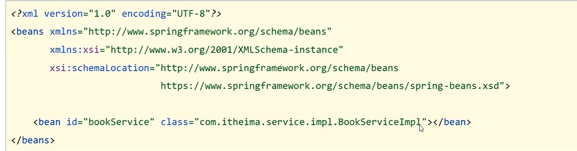

4. 初始化IoC容器

   ```java
   ApplicationContext context = new ClassPathXmlApplicationContext("applicationContext.xml");
   context.getBean("Bean对象名")
   ```


# DI入门案例分析

1. 删除业务层中用new方式创建的dao对象，利用set方法，给这个接口提供对应的实现类

   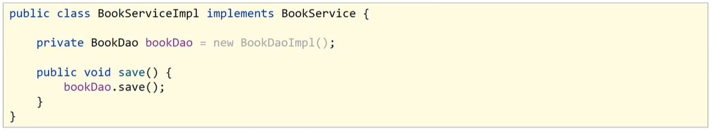

2. 配置service与dao的联系

   1)name表示配置具体的属性

   2)ref表示给这个bookDao属性的set传一个Bean进去赋值。

   ```java
   <property name = "bookDao" ref = "bookDao"/>
   ```


# Bean配置基础

1. Bean可以加多个名称name，name可定义多个。

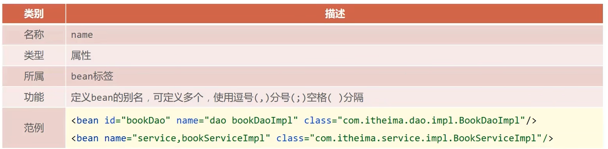

2. Bean的单例模式(作用范围)

> Bean对象创建出来的可能是单例single(默认)或者多个prototype
>
> ```
> scope="singleton/prototype"
> ```

* 适合多个对象的bean：表现层、业务层、数据层、工具对象


# Spring实例化Bean

1. 构造函数

> Bean本质上就是创建对象，Spring会调用Bean对象的构造方法来创建,默认调用无参构造。（通过反射）

​	如果无参构造不存在，抛出异常==BeanCreationException==

2. 工厂实例化

​	1)什么是工厂模式 ?

   >工厂类会返回一个对象实例，调用者想创建一个对象，只要知道其名称就可以了，创建对象的时候不会对客户端暴露业务逻辑。

​	2)**静态**工厂实例化bean class="工厂类" factory-method="工厂实例方法" 这样就能得到工厂所返回的实例

```java
<!--方式二：使用静态工厂实例化bean-->
<bean id="orderDao" class="com.itheima.factory.OrderDaoFactory" factory-method="getOrderDao"/>
```

​	3)动态工厂实例化bean

```java
<!-- 首先要创建实例工厂 factory-bean指定实例工厂bean 后面再用factory-method 来创建工厂 -->
<bean id="userFactory" class="com.itheima.factory.UserDaoFactory"/>
<bean id="userDao" factory-method="getUserDao" factory-bean="userFactory"/>
```

​	4)简化动态工程实例化bean

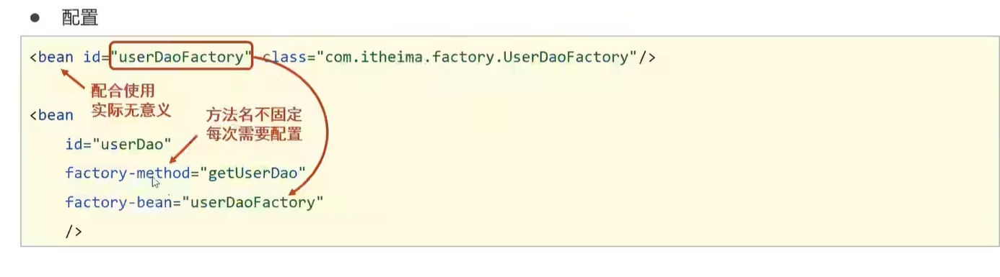

​	实现FactoryBean接口

```java
//FactoryBean创建对象 创建什么对象就用什么泛型
public class UserDaoFactoryBean implements FactoryBean<UserDao> {
    //代替原始实例工厂中创建对象的方法
    public UserDao getObject() throws Exception {
        return new UserDaoImpl();
    }

    public Class<?> getObjectType() {
        return UserDao.class;
    }
}

applicationContext.xml
<!--方式四：使用FactoryBean实例化bean-->
    <bean id="userDao" class="com.itheima.factory.UserDaoFactoryBean"/>
```

# Bean的生命周期

Spring管理的bean对象是具有生命周期的，可以设置初始化和销毁函数

* 创建bean实例会触发init-method 

* java虚拟机关闭的时候，不会触发destroy-method，要用下面该两种方法。

  > 1. ClassPathXmlApplicationContext的实现类有close() 可以手动关闭触发析构函数
  > 2. registerShutdownHook

  ```java
  ClassPathXmlApplicationContext ctx = new ClassPathXmlApplicationContext("applicationContext.xml");
  BookDao bookDao = (BookDao) ctx.getBean("bookDao");
  ctx.registerShutdownHook();//自动关闭容器的时候触发钩子
  ctx.close();//强行关闭容器 触发钩子
  ```

* 指定析构函数

  ```xml
  <bean id="bookDao" class="全类名" init-method="init" destroy-method="destory"/>
  ```

* 利用目标bean对象**实现接口**的形式，，控制bean的析构函数，可以避免向上面在xml对应接口

  ```java
  public class BookServiceImpl implements BookService, InitializingBean, DisposableBean {
      private BookDao bookDao;
  
      public void setBookDao(BookDao bookDao) {
          System.out.println("set .....");
          this.bookDao = bookDao;
      }
  
      public void save() {
          System.out.println("book service save ...");
          bookDao.save();
      }
  	//重写DisposableBean
      public void destroy() throws Exception {
          System.out.println("service destroy");
      }
  	//初始化InitializingBean 在属性设置完成以后 运行此操作
      public void afterPropertiesSet() throws Exception {
          System.out.println("service init");
      }
  }
  ```


# 依赖注入方式

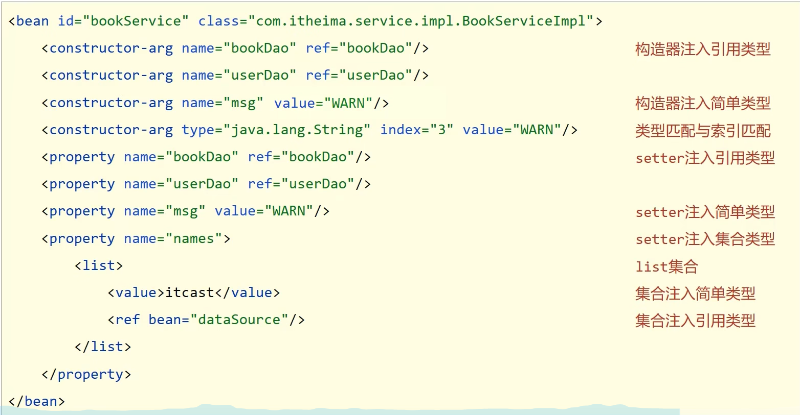

## 1. Sette注入

比如下面的book实现类,利用setter给bookDao赋值

```java
public class BookServiceImpl implements BookService, InitializingBean, DisposableBean {
    private BookDao bookDao;

    public void setBookDao(BookDao bookDao) {
        System.out.println("set .....");
        this.bookDao = bookDao;
    }
```

我们用配置的方式触发bean的set功能，在xml配置Bean对象内部添加 property

1) **ref**:引用bean对象

```xml
<bean id="bookDao" class="com.itheima.dao.impl.BookDaoImpl"  scope="singleton"  init-method="init" destroy-method="destory"/>

<bean id="bookService" class="com.itheima.service.impl.BookServiceImpl">
      <property name="bookDao" ref="bookDao"/>
 </bean>
```

2. value:传基础数据类型的值

```xml
    <bean id="bookDao" class="com.itheima.dao.impl.BookDaoImpl">
        <!--property标签：设置注入属性-->
        <!--name属性：设置注入的属性名，实际是set方法对应的名称-->
        <!--value属性：设置注入简单类型数据值-->
        <property name="connectionNum" value="100"/>
        <property name="databaseName" value="mysql"/>
    </bean>
```

## 2. 构造器注入

利用配置，给构造方法注入Bean对象,配置代码如下

小细节:

1. name表示形参的变量名
2. index可以指定参数的个数

```xml
    <bean id="bookService" class="com.itheima.service.impl.BookServiceImpl">
        <constructor-arg index="0" ref="userDao"/>
        <constructor-arg name="bookDao" ref="bookDao"/>
    </bean
```


==依赖注入的选择==：可选的依赖项选择setter，构造器注入必须要进行配置。


## 3. 依赖自动装配

> IoC容器可利用bean对象的 “autowire” 进行自动装配
>
> 可选值有
>
> 1)byType 根据当前已经声明的bean对象的类型进行注入，必须保证同类的bean对象唯一
>
> 2)byName 根据当前声明的bean对象的名字和参数匹配进行注入，必须保证同类的bean对象
>
> 注意点有：
>
> 1）自动装配优先级最低，并且不推荐用自动装配

``` java
  <bean id="bookService" class="com.BookServiceImpl" autowire="byType"></bean>
```

## 4. 集合注入

> Sping管理的bean对象也支持下类对象的直接注入
>
> 1)数组
> 2)List
>
> 3)Set
>
> 4)Map
>
> 5)Properties

```xml
 <!--数组注入-->
<property name="array">
    <array>
        <value>100</value>
        <value>200</value>
        <value>300</value>
    </array>
</property>
<!--list集合注入-->
<property name="list">
    <list>
        <value>itcast</value>
        <value>itheima</value>
        <value>boxuegu</value>
        <value>chuanzhihui</value>
    </list>
</property>
<!--set集合注入-->
<property name="set">
    <set>
        <value>itcast</value>
        <value>itheima</value>
        <value>boxuegu</value>
        <value>boxuegu</value>
    </set>
</property>
<!--map集合注入-->
<property name="map">
    <map>
        <entry key="country" value="china"/>
        <entry key="province" value="henan"/>
        <entry key="city" value="kaifeng"/>
    </map>
</property>
<!--Properties注入-->
<property name="properties">
    <props>
        <prop key="country">china</prop>
        <prop key="province">henan</prop>
        <prop key="city">kaifeng</prop>
    </props>
</property>
```

# sping加载properties

* 开启context命名空间

```xml
<?xml version="1.0" encoding="UTF-8"?>
<beans xmlns="http://www.springframework.org/schema/beans"
       xmlns:xsi="http://www.w3.org/2001/XMLSchema-instance"
       
       添加这个
       xmlns:context="http://www.springframework.org/schema/context"
       
       xsi:schemaLocation="
            http://www.springframework.org/schema/beans
            http://www.springframework.org/schema/beans/spring-beans.xsd
            
            添加下面两个
            http://www.springframework.org/schema/context
            http://www.springframework.org/schema/context/spring-context.xsd
            ">
```

* 使用context命名空间，加载指定properties文件

```xml
	2. 使用context空间加载properties文件 如果要多个文件，用逗号隔开
    <context:property-placeholder location="jdbc.properties"/>

    3. *.properties  设置加载当前工程类路径中的所有properties文件
    system-properties-mode属性：是否加载系统属性
    <context:property-placeholder location="*.properties" system-properties-mode="NEVER"/>
	
	4.推荐写法
    <context:property-placeholder location="classpath:*.properties" system-properties-mode="NEVER"/>

    5.classpath*:*.properties  ：  设置加载当前工程类路径和当前工程所依赖的所有jar包中的所有properties文件
    <context:property-placeholder location="classpath*:*.properties" system-properties-mode="NEVER"/>

```

> 譬如下面的properties

```properties
# jd.properties 文件
    
jd.a=10
jd.b=20
```

==利用${变量名}可以读取,**注意如果系统变量和此变量重名，需要进行忽略系统变量**==


# 容器

## 各种加载配置文件的方式

> ApplicationContext 的实现类常用的俩 分别不同的加载方式

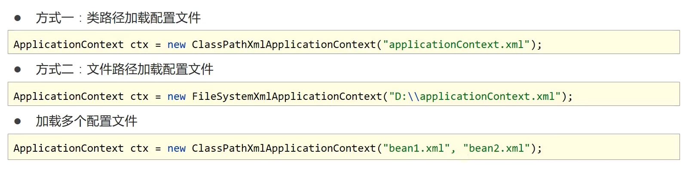

## 获取bean的几种方式

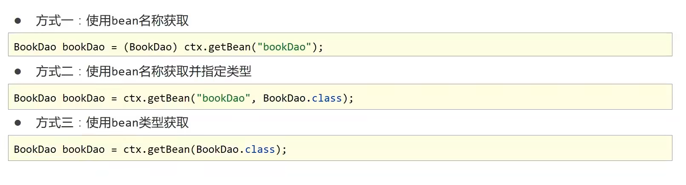

## BeanFactory

> BeanFactory是所有容器类的顶层接口 会进行延迟加载

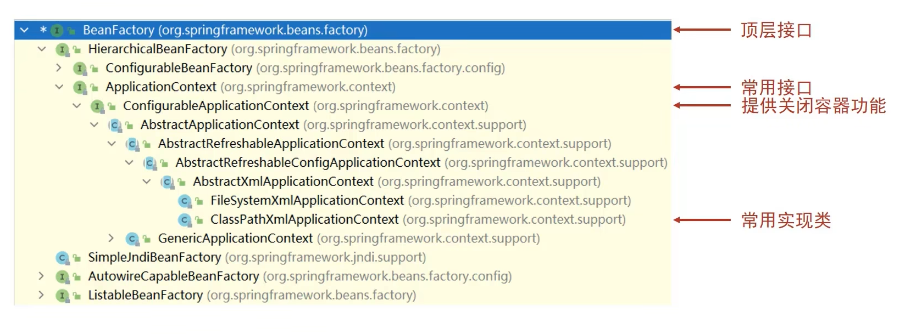


# Bean全部配置属性

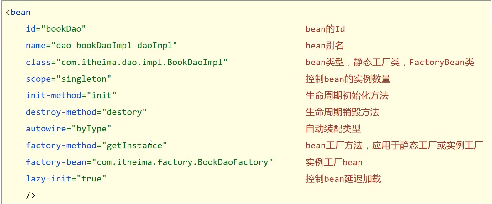


# 注解开发配置bean对象

1. 注解标识bean对象 (参数可以为空，代表未指定id的bean对象)

   ```java
   @Component("bookDao")
   public class BookDaoImpl implements BookDao {
       public void save() {
           System.out.println("book dao save ...");
       }
   }
   ```

2. 配置文件，添加扫描类包

   ```xml
   <beans xmlns="http://www.springframework.org/schema/beans"
          xmlns:context="http://www.springframework.org/schema/context"
          xmlns:xsi="http://www.w3.org/2001/XMLSchema-instance"
          xsi:schemaLocation="
           http://www.springframework.org/schema/beans http://www.springframework.org/schema/beans/spring-beans.xsd
           http://www.springframework.org/schema/context http://www.springframework.org/schema/context/spring-context.xsd">
   
       <context:component-scan base-package="com.itheima"/>
   </beans>
   ```

3. 衍生注解,功能一样，只是方便我们理解。

   


# 纯注解开发

> 利用配置类来带替配置文件
>
> @Configuration 声明当前类是Sping配置类
>
> @ComponentScan 设置扫描路径 多个路径书写为字符串数组格式

```java
        //声明当前类为Spring配置类
        @Configuration
        @ComponentScan({"com.itheima.service","com.itheima.dao"})
        public class SpringConfig {
        }
```

> 加载容器的时候，需要使用实现类AnnotationConfigApplicationContext

```java
        //AnnotationConfigApplicationContext加载Spring配置类初始化Spring容器
        ApplicationContext ctx = new AnnotationConfigApplicationContext(SpringConfig.class);
        BookDao bookDao = (BookDao) ctx.getBean("bookDao");
```


# 第三方操作bean

> 定义一个方法，放回置就是目标Bean

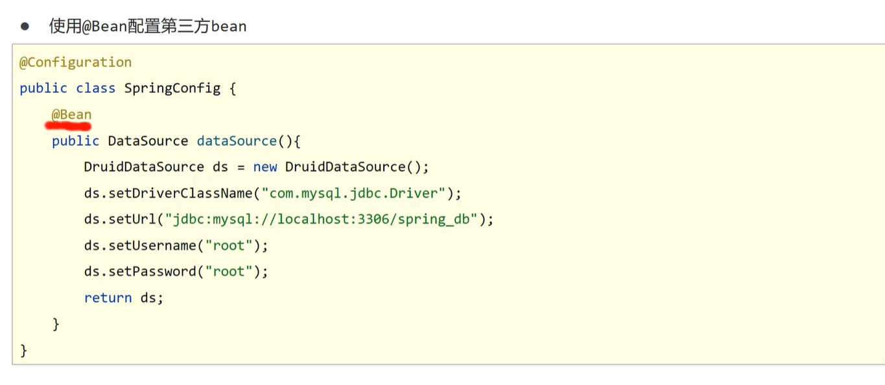

> 通常将配置和核心Sping配置分开，利用两种方法进行导入
>
> 1)导入式 （推荐）
>
> 2)扫描式 

1. 导入式

   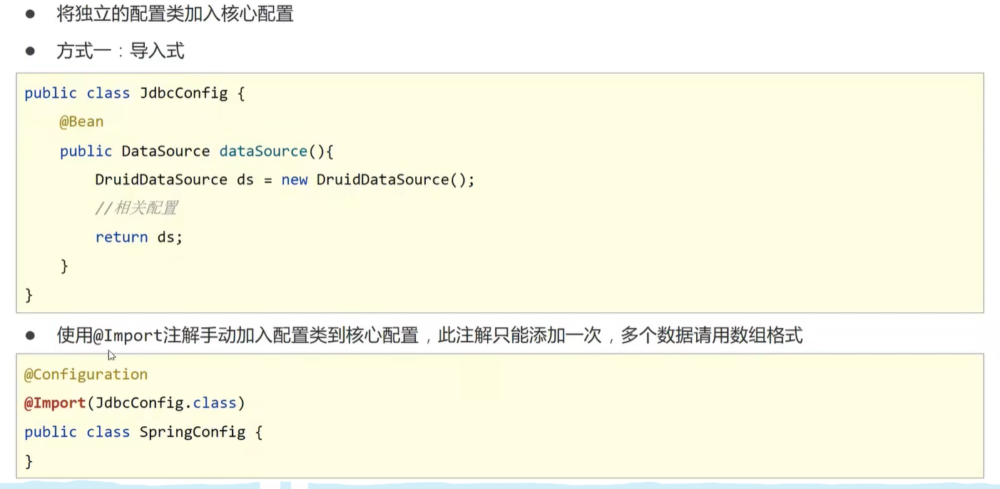

2. 扫描式

   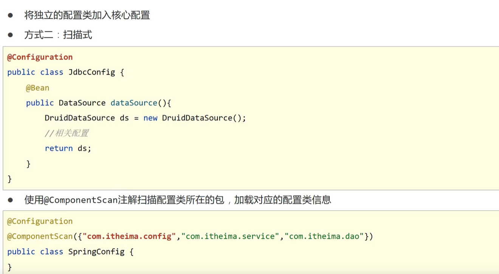


# 注解开发为第三方Bean注入

> 1. 简单类型的利用成员变量+Value来进行注入


> 2. 引用类型利用传值的方式进行注入，参数会按类型检测进行自动装配

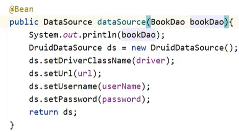

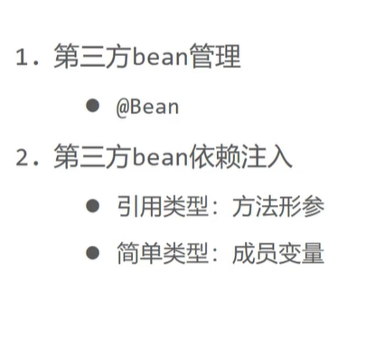

# 注解整合

| 注解           | 值                  | 说明                                                         |
| -------------- | ------------------- | ------------------------------------------------------------ |
| Component      | bean对象id          |                                                              |
| Repository     | bean对象id          | 标识数据类的bean对象                                         |
| Controller     | bean对象id          | 标识控制器类的bean对象                                       |
| Service        | bean对象id          | 标识服务类的bean对象                                         |
| Scope          | singleton/prototype | bean对象作用范围                                             |
| PostConstruct  |                     | 标识方法为构造前触发                                         |
| PreDestory     |                     | 表示方法为关闭前触发                                         |
| Autowired      |                     | 按类型自动装配（注解强行装配                                 |
| Qualifier      | bean对象            | 必须依赖Autowired，用来解决多个同类型时根据id指定对象。      |
| Value          | 字符串              | 基础数据类型的注入                                           |
| PropertySource | 字符串/字符串数组   | 在注解配置上类上写，指定数据源。不支持通配符,后面变量名用${}表示 |
| Bean           | 值是bean的id        | 表示方法的返回值封装成bean                                   |
| ComponentScan  | 字符串数组          | 扫描的包                                                     |
|                |                     |                                                              |


# XML配置和注解配置比较

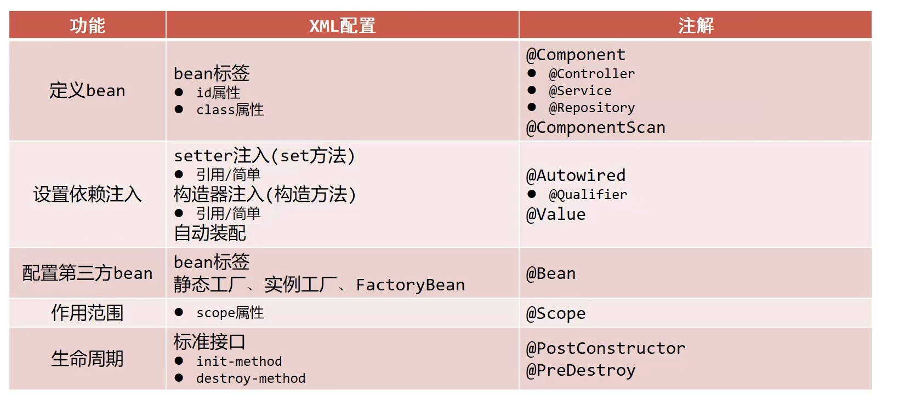


# Sping整合MyBatis 

