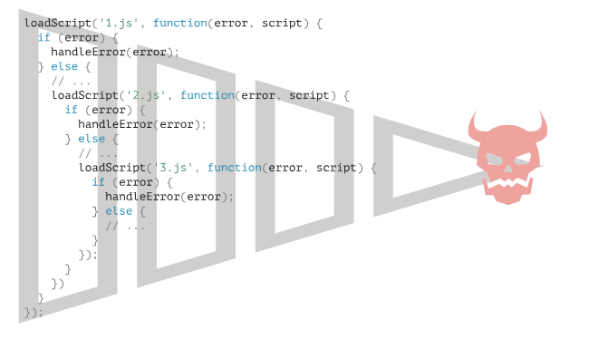

# 回调地狱

学习promise之前首先了解一下什么是回调地狱


比如有ABCD四个异步的请求，需要按照执行顺序如下A->B->C->D

A获取值给B用，B获取值给C用， C获取值给D用。

如果直接写

```js
A()
B()
C()
D()
```

**因为是异步的请求**，每一行代码不会等上一行代码完成而阻塞，因此不知道谁**先**完成，我们要求的顺序就不对了。


* 如何解决上述问题？


我们可以利用回调函数的一个嵌套

就会有如下的代码

```js
function get (A,B,C,D){
	A();
    if A完成了:
        B();
    	if B完成了:
        	C();
    		if C完成了:
        		D();
}

A=function(){某个异步请求}
B=function(){某个异步请求}
C=function(){某个异步请求}
D=function(){某个异步请求}

get(A,B,C,D)
```

为了异步获取信息，就得进行回调函数的嵌套。

上面代码就叫做**回调地狱**，很明显代码不容易维护...如果请求狠多的话，代码结构和复用性都会很差。

有时这些被称为“回调地狱”或“厄运金字塔”。

嵌套调用的“金字塔”随着每个异步行为会向右增长。很快它就失控了。

所以这种编码方式不是很好。



# promise

* `promise`简单介绍

  是个把请求和使用连在一起的一个特殊的`JavaScript`对象，这么说有点抽象，可以这样理解。厨师就是请求，客人就是使用。只有厨师做完了餐，客人才能第一时间用餐。

* `promise`对象的构造器 (厨师)

```js
let promise = new Promise(function(resolve, reject) {
  // executor（厨师做饭，“厨师”）
});
```

抽象比喻：当`promise`被创建，executor会自动执行，如果成功了，就会调用`resolve`给客人用餐，如果失败了，就会调用`reject`告诉客人失败的原因。

所以总结一下就是：executor 会自动运行并尝试执行一项工作。尝试结束后，如果成功则调用 `resolve`，如果出现 error 则调用 `reject`。


值得注意的是：一个Promise 只能有一个结果，成功或者失败。如果出现了多个reject 或者 resolve 后面的都会被忽略

```js
let promise = new Promise(function(resolve, reject) {
  resolve("done");

  reject(new Error("…")); // 被忽略
  setTimeout(() => resolve("…")); // 被忽略
});
```

* `promise`对象的状态
  * pending 正在执行
  * fulfilled 完成了
  * rejected 错误


* promise的使用者

  * then(传入两个回调函数)：

  ```js
  promise.then(
    function(result) { /* handle a successful result */ },
    function(error) { /* handle an error */ }
  );
  ```

  `.then` 的第一个参数是一个函数，该函数将在 promise resolved 后运行并接收结果。

  `.then` 的第二个参数也是一个函数，该函数将在 promise rejected 后运行并接收 error。


  * catch(errorHandlingFunction)  

  如果我们只对 error 感兴趣，那么我们可以使用 `null` 作为第一个参数：`.then(null, errorHandlingFunction)`。或者我们也可以使用 `.catch(errorHandlingFunction)`，其实是一样的：

  

  * finally` 处理程序（handler）没有参数。在 `finally` 中，我们不知道 promise 是否成功。没关系，因为我们的任务通常是执行“常规”的定稿程序（finalizing procedures）。


  ```js
  let promise = new Promise(function(resolve, reject) {
      .....
  }).then( function (result){
      成功了，结果是..result
  }).cathch(function(error){
      失败了，结果是..
  }).finally(functino(){});
  
  ```

  


# Promise 链 —— 回调地狱的解决方案

我们可以用promise来完成最开始的需求

```js

let ap = new promise((resolve,reject)=>{
    A()
    resolve(”A完成了")
});

let bp =new promise((resolve,reject)=>{
    B()
    resolve(”B完成了")
});

let cp = new promise((resolve,reject)=>{
    c()
    resolve(”C完成了")
});

let ap = new promise((resolve,reject)=>{
    D()
    resolve(”d完成了")
});

ap.then(()=>{
	return bp();//执行完了，准备返回B 让后面用
}).then(()=>{
    return cp();
}).then(()=>{
    return dp();
}).then(()=>{
    结束了
})
```


可以看到上面代码形成了一条链条——primise链


但是代码还是不太美观，如何优化呢？


# async 与 await

解决上面的promise链问题，我们可以用async 与 await来优化


只要在返回promise对象前加`await`，就能直接获取一个promise对象，,await 它会阻塞后面的代码。

在外层函数用`async `


这就是回调地狱的终极解决方案：

把异步的请求变成同步操作。

```

async function get(){
	let a = await new promise((resolve,reject)=>(){});//执行A的异步操作 获取A的值
	
	let b = await new promise((resolve,reject)=>(){});//执行B的异步操作 获取B的值
	
	let c = await new promise((resolve,reject)=>(){});//执行C的异步操作 获取c的值
	
	let d = await new promise((resolve,reject)=>(){});//执行D的异步操作 获取d的值
	
});
	
}
```


**一句话，async 函数就是 Generator 函数的语法糖。**

async 函数返回一个 Promise 对象，可以使用 then 方法添加回调函数。当函数执行的时候，一旦遇到 await 就会**先执行async函数同级的下条元素**，等到触发的异步操作完成，再接着执行函数体内后面的语句。

如下面代码：

```
睡觉()
get()
打游戏()
```

如果我们在get中遇到有await，我们会执行打游戏。而不是在get里阻塞，实现了**函数外异步**，函数内**带有await的请求**同步。

```js
async function get() {
    console.log("开始异步了！！")
    let data = await new Promise((resolve, reject) => {
        setTimeout(() => {
            resolve("睡觉");
        }, 5000);
    });
    console.log(data);
}
console.log("吃饭");
get();
console.log("打游戏");

//结果是  
//吃饭
//开始异步了
//打游戏
//睡觉
```

