vue的学习有一阵子了，打算在这新的一年花一点时间去沉淀一下。本篇文章主要是围绕vue2.0官方文档进行简化和总结，如果读者是零基础，请阅读官方文档~ 

(2022/1/3... 持续更新

https://cn.vuejs.org/v2/guide

@[TOC](Vue2.0学习笔记)
# Vue的介绍
Vue主要采用了MVVM的设计模式，是原来的MVC设计模式的一个升级。以前传统的MVC,是将后端数据手动渲染到前端页面,将业务逻辑和前端渲染彻底分开。
MVVM本质上就是MVC 的改进版，指的是(**M**odel,**V**iew,**V**iew**M**odel),三者相互协调。

* MVVM的工作原理

当数据源发生变化的时候，ViewMode就会监听到，负责**自动渲染**到视图层。

当表单数据发生变化时，也会被监听到，并且**自动同步**到Model的数据源之中。

# Vue2.0
Vue有很多模板语法和指令

## 指令篇

### 内容渲染
* 内容渲染
	* v-text
	* 插值表达式
	* v-html

**1. v-text**
v-text 作为属性可以覆盖原来标签的内容
```html
<div id='app'>
        <p v-text='message'>原来的内容</p>

    </div>
    <script type='text/javascript'>
        var app = new Vue({
            el: '#app',
            data: {
                message: 'Hello! Vue!'
            }
        });
    </script>
```


---
**2. 插值表达式**
数据绑定最常见的形式就是使用“Mustache”语法 (双大括号) 的文本插值：
```html
    <div id='app'>
        <p>{{message}}</p>
    </div>
```

Mustache 标签将会被替代为对应数据对象上 msg property 的值。无论何时，绑定的数据对象上 msg property 发生了改变，插值处的内容都会更新。

比如此处'Hello! Vue!'

用js代码修改为

通过使用 v-once 指令，你也能执行一次性地插值，当数据改变时，插值处的内容不会更新。但请留心这会影响到该节点上的其它数据绑定：
```html
<span v-once>这个将不会改变: {{ msg }}</span>
```

---
**3.v-html**
双大括号会将数据解释为普通文本，而非 HTML 代码。为了输出真正的 HTML，你需要使用 v-html 指令：

* 未使用
```html
    <div id='app' >
        <p>{{message}}</p>
    </div>  
    <script type='text/javascript'>
        var app = new Vue({
            el: '#app',
            data: {
                message: '<h1>你们好</h1>'
            }
        });
    </script>
```
 

* 使用v-html
```html
<div id='app'>
        <p v-html='message'></p>
    </div>
    <script type='text/javascript'>
        var app = new Vue({
            el: '#app',
            data: {
                message: '<h1>你们好</h1>'
            }
        });
    </script>
```


> 要注意绝不要对用户提供的内容使用插值，防止xss攻击。


---
### 条件渲染
v-if 指令用于条件性地渲染一块内容。
也可以用 v-else 添加一个“else 块”：
```html
<h1 v-if="awesome">Vue is awesome!</h1>
<h1 v-else>Oh no 😢</h1>
```

v-else-if，顾名思义，充当 v-if 的“else-if 块”，可以连续使用
```html
<div v-if="type === 'A'">
  A
</div>
<div v-else-if="type === 'B'">
  B
</div>
<div v-else-if="type === 'C'">
  C
</div>
<div v-else>
  Not A/B/C
</div>
```

#### 用key管理可复用的元素
Vue 会尽可能高效地渲染元素，通常会复用已有元素而不是从头开始渲染。比如切换的时候会复用原有的input输入内容。


* **增加Key**
但有时候没有对应的需求，可以告诉vue，让两个元素独立，不进行复用。只需添加一个具有唯一值的` key attribute `即可：
```html
<template v-if="loginType === 'username'">
  <label>Username</label>
  <input placeholder="Enter your username" key="username-input">
</template>
<template v-else>
  <label>Email</label>
  <!-- 增加key以后，input不会被复用，但是label还是会被复用 -->
  <input placeholder="Enter your email address" key="email-input">
</template>
```

---
### 循环渲染


* 语法1 **item in items**
可以用v-for来循环一个list，v-for 指令需要用**item in items** 形式的特殊语法，期中items是数据源，item是迭代器别名。

```html
<ul id="example-1">
  <li v-for="item in items" :key="item.message">
    {{ item.message }}
  </li>
</ul>
```

```html
var example1 = new Vue({
  el: '#example-1',
  data: {
    items: [
      { message: 'Foo' },
      { message: 'Bar' }
    ]
  }
})
```


* 结果

* 语法2 **(item,index) in items**
在v-for中，还能支持另外一种写法，表示当前的索引

```html
<ul id="example-2">
  <li v-for="(item, index) in items">
    {{ parentMessage }} - {{ index }} - {{ item.message }}
  </li>
</ul>
```
---
* 语法3 **在v-for里访问对象** **value in object**
我们可以在v-for里，去遍历一个对象的所有property
```html
<ul id="v-for-object" class="demo">
  <li v-for="value in object">
    {{ value }}
  </li>
</ul>
<script>
new Vue({
  el: '#v-for-object',
  data: {
    object: {
      title: 'How to do lists in Vue',
      author: 'Jane Doe',
      publishedAt: '2016-04-10'
    }
  }
})
</script>
```

* 语法4   (value,key)w in  obj
* 语法5  (value, key, index) in obj


#### 维护状态

因为vue的更新渲染策略，是采用**就地更新**的策略，而不是重新渲染，因此对于循环渲染，需要给vue一个提示**key**，以便它能跟踪每个节点，从而重用和重新排序现有元素，你需要为每项提供一个唯一 **key attribute：**


```
<div v-for="item in items" v-bind:key="item.id">
  <!-- 内容 -->
</div>
```
key  最好是能唯一表示每一条数据的数字 如id

---
### 属性绑定 v-bind:
插值表达式不能直接应用到属性中，如。
```html
 <div id='app'>
        <p title="{{message}}">标题</p>
    </div>
    <script type='text/javascript'>
        var app = new Vue({
            el: '#app',
            data: {
                message: '这是一个标题'
            }
        });
    </script>
```

为了解决这个问题，可以使用  **v-bind:属性名**。
```html
<div id='app'>
		<p v-bind:title="message">标题</p>
	</div>
	<script type='text/javascript'>
		var app = new Vue({
			el: '#app',
			data: {
				message: '这是一个标题'
			}
		});
	</script>
```

* 小技巧 
v-bind: 可以用 :简写


---
### 事件绑定 v-on:
可以用 v-on 指令监听 DOM 事件，并在触发时运行一些 JavaScript 代码。

```html

<body>
	<div id='app'>
		<p>{{counter}}</p>
		<button v-on:click="counter+=1">+1</button>
	</div>
	<script type='text/javascript'>
		var app = new Vue({
			el: '#app',
			data: {
				counter: 0,
			}
		});
	</script>
</body>
```

注意: 上面的代码在v-on:click里执行了一个js代码，也就是说在双引号里的代码是js代码，所以我们也能调用方法

在Vue构造实例里，增加methods,并且用v-on:绑定这个事件
```html
	<div id='app'>
		<p>{{counter}}</p>
		<button v-on:click="show">+1</button>
	</div>
	<script type='text/javascript'>
		var app = new Vue({
			el: '#app',
			data: {
				counter: 0,
			},
			methods: {
				show: function () {
					alert('123');
				}
			},
		});
	</script>
```


有时候我们需要在内联语句处理器中访问原始的 DOM 事件event，只需要传参即可~


---
#### 事件修饰符
对于某些事件，我们需要进行一些限制，如：阻止冒泡，限制原有行为。

我们通常用js来操作原生的dom事件
如下：防止表单提交自动刷新页面


```html
	<div id='app'>
		<button v-on:click="counter+=1">+1</button>
		<form v-on:submit="sb">
			<input v-model="counter"></input>
			<input type="submit"></input>
		</form>
	</div>
	<script type='text/javascript'>
		var app = new Vue({
			el: '#app',
			data: {
				counter: 0,
			},
			methods: {
				show: function (e) {
					console.log(e);
				},
				sb: function (event) {
					event.preventDefault();
					alert("submit successful!");
				}
			},
		});
	</script>
```

我们能通过一些事件修饰符来代替原来的操作
```html
	<div id='app'>
		<button v-on:click="counter+=1">+1</button>
		<form v-on:submit.prevent='sb'>
			<input v-model="counter"></input>
			<input type="submit" v-on:click.prevent='sb'></input>
		</form>
	</div>
	<script type='text/javascript'>
		var app = new Vue({
			el: '#app',
			data: {
				counter: 0,
			},
			methods: {
				show: function (e) {
					console.log(e);
				},
				sb: function () {
					alert("submit successful!");
				}
			},
		});
	</script>
```

为了解决这个问题，Vue.js 为 v-on 提供了事件修饰符。之前提过，修饰符是由点开头的指令后缀来表示的。

.stop
.prevent
.capture
.self
.once
.passive


```html
<!-- 阻止冒泡 -->
<a v-on:click.stop="doThis"></a>

<!-- 提交事件不再重载页面 -->
<form v-on:submit.prevent="onSubmit"></form>

<!-- 修饰符可以串联 -->
<a v-on:click.stop.prevent="doThat"></a>

<!-- 只有修饰符 -->
<form v-on:submit.prevent></form>

<!-- 添加事件监听器时使用事件捕获模式 -->
<!-- 即内部元素触发的事件先在此处理，然后才交由内部元素进行处理 -->
<div v-on:click.capture="doThis">...</div>

<!-- 只当在 event.target 是当前元素自身时触发处理函数 -->
<!-- 即事件不是从内部元素触发的 -->
<div v-on:click.self="doThat">...</div>
```

#### 按键修饰符
在监听键盘事件时，我们经常需要检查详细的按键。Vue 允许为 v-on 在监听键盘事件时添加按键修饰符：

.enter
.tab
.delete (捕获“删除”和“退格”键)
.esc
.space
.up
.down
.left
.right

如下列代码，按esc可以清空文本，按enter可以提交
```html
<div id='app'>
		<button v-on:click="counter+=1">+1</button>
		<form v-on:keyup.enter='sb'>
			<input v-model="counter" v-on:keyup.esc='counter=0'></input>
			<input type="submit" v-on:click.prevent='sb'></input>
		</form>
	</div>
	<script type='text/javascript'>
		var app = new Vue({
			el: '#app',
			data: {
				counter: 0,
			},
			methods: {
				show: function (e) {
					console.log(e);
				},
				sb: function () {
					alert("submit successful2!");
				}
			},
		});
	</script>
```


*  简写的小技巧

1. ES6语法方法简写
```html
	<script type='text/javascript'>
		var app = new Vue({
			el: '#app',
			data: {
				counter: 0,
			},
			methods: {
				show: function () {
					alert('123');
				},
				//在es6的语法中，方法可以省去function
				show2() {
					alert('666')
				}
			},
		});
	</script>
```

2. v-on: 可以简写为@


---
### 双向绑定指令 v-model

Vue.js 可以用 v-model 指令在表单 `<input>`、`<textarea> `及 `<select> `创建双向数据绑定。它会根据控件类型自动选取正确的方法来更新元素。尽管有些神奇，但 v-model 本质上不过是语法糖。它负责监听用户的输入事件以更新数据，并对一些极端场景进行一些特殊处理。

代码非常好理解，直接看代码即可~
```html
	<div id='app'>
		<h3>input 输入文本 展示</h3>
		<p>{{data1}}</p>
		<input v-model="data1"></input>
		<br>

		<h3>input 复选选框 展示</h3>
		<input type="checkbox" id="checkbox" v-model="checked">
		<label for="checkbox">{{ checked }}</label>
		<br>

		<div>多个复选框绑定同一个数组</div>
		<input type="checkbox" id="jack" value="Jack" v-model="checkedNames">
		<label for="jack">Jack</label>
		<input type="checkbox" id="john" value="John" v-model="checkedNames">
		<label for="john">John</label>
		<input type="checkbox" id="mike" value="Mike" v-model="checkedNames">
		<label for="mike">Mike</label>
		<br>
		<span>Checked names: {{ checkedNames }}</span>
		<br>

		<div>单选按钮</div>
		<input type="radio" id="one" value="One" v-model="picked">
		<label for="one">One</label>
		<br>
		<input type="radio" id="two" value="Two" v-model="picked">
		<label for="two">Two</label>
		<br>
		<span>Picked: {{ picked }}</span>


		<h3>选择框select</h3>
		<select v-model='selected'>
			<option disabled value=''>请选择</option>
			<option>A</option>
			<option>B</option>
			<option>C</option>
		</select>
		<div>Your Selected : {{selected}}</div>

		<h3>多选框 select</h3>
		<select v-model='selected' multiple style="width: 50px">
			<option>A</option>
			<option>B</option>
			<option>C</option>
		</select>
		<div>Your Selected : {{selected}}</div>

		<!-- 也能用v-for动态渲染selected -->
		<h3>动态渲染 select</h3>
		<select v-model='selected' multiple style="width: 50px">
			<option v-for='item in checkedNames' value='item'>{{item}}</option>
		</select>
		<div>Your Selected : {{selected}}</div>
	</div>
	<script type='text/javascript'>
		var app = new Vue({
			el: '#app',
			data: {
				data1: 0,
				checked: false,
				checkedNames: [],
				picked: '',
				selected: '',
			},
		});
	</script>
```


---
#### 双向绑定修饰符
在默认情况下，v-model 在每次 input 事件触发后将输入框的值与数据进行同步 (除了上述输入法组合文字时)。你可以添加 lazy 修饰符，从而转为在 change 事件_之后_进行同步：
```html
<!-- 在“change”时而非“input”时更新 -->
<input v-model.lazy="msg">
```

.number
如果想自动将用户的输入值转为数值类型，可以给 v-model 添加 number 修饰符：
这通常很有用，因为即使在 type="number" 时，HTML 输入元素的值也总会返回字符串。**如果这个值无法被 parseFloat() 解析，则会返回原始的值。**
```html
<input v-model.number="age" type="number">
```

.trim
如果要自动过滤用户输入的首尾空白字符，可以给 v-model 添加 trim 修饰符：
```html
<input v-model.trim="msg">
```

---
## 计算属性与侦听器


### 计算属性
* 介绍
计算属性可以类比有返回值的函数，但是更加高效，因为会进行**缓存**，当且仅当能够影响结果的变量，发生变化的时候才会去重新计算。

* 注意
计算属性虽然长得像方法，但是无法进行传参。
```html
	<div id='app'>
		<button @click='f(getPower)'>get</button>
	</div>
	<script type='text/javascript'>
		var app = new Vue({
			el: '#app',
			data: {
				cnt: 2,
			},
			methods: {
				f(a) {
					alert(a);
				}
			},
			computed: {
				getPower() {
					return this.cnt * this.cnt;
				}
			}
		});
```


### 侦听器
* 普通侦听器

在watch里面
格式为 
侦听的数据和计算属性 : function(){}

```html
	<div id='app'>
		<div>
			<input v-model.lazy="firstName"></input>
			<input v-model.lazy="lastName"></input>
		</div>
		<p>your fullName is {{fullName}}</p>
		<div>{{get}}</div>
	</div>
	<script type='text/javascript'>
		var app = new Vue({
			el: '#app',
			data: {
				firstName: 'Foo',
				lastName: 'Bar',
				fullName: 'Foo Bar',
				f: 1,
			},
			methods: {

			},
			computed: {
				get() {
					return this.f + 1;
				}
			},
			watch: {
				firstName(val, oldVal) {
					this.fullName = val + ' ' + this.lastName;
					console.log(val + "<= " + oldVal);
				},
		
				get(val, oldVal) {
					console.log(val + ' ' + oldVal);
				}
			}
		});
	</script>
```
## Vue的生命周期
## Vue构造的组成结构


# vue-cli 


## vue-cli 使用

* 在指定目录运行

```html
vue create 项目名
```

* vue项目中**src目录**的构成：

```html
assets 文件夹： 存放项目中用到的静态资源文件，css 样式表
components 文件夹： 封装的可复用组件放到此目录
main.js 项目入口文件，项目的运行要先执行main.js
```

* vue项目中public目录构成

```
里面的资源不会被webpack打包压缩，也是存储静态文件。
```


## vue 项目的运行流程


### 解析main.js文件

在工程化的项目中，vue通过main.js 把 App.vue 渲染到index.html 的指定区域中，main.js文件非常关键。

```js
// 导入vue包 得到vue构造函数
import Vue from 'vue'
// 导入vue.vue 组件 把app.vue 模板结构渲染到html页面之中
import App from './App.vue'

Vue.config.productionTip = false

// 创建vue实例对象 以下两个写法都可以
new Vue({
  // render 函数指定组件渲染到html页面之中 App 就是根组件
  render: h => h(App),
}).$mount('#app')

new Vue({
  el: '#app',
  // render 函数指定组件渲染到html页面之中
  render: h => h(App),
})

```

上文的$mount是内置函数,代表挂载的意思，举例：

```html
 <div id='app'>
        {{username}}
    </div>
    <script type="text/javascript">
        const vm = new Vue({
            // el:'#app',
            data: {
                username: 'fxw'
            },
        });
        vm.$mount('#app');
    </script>
```

# Vue 组件

1. 组件化，方便ui结构的复用
2. vue是支持组件化的前端框架，vue中规定，**组件的后缀名是.Vue。**


##  Vue组件组成部分

每个.vue组件由三部分组成

* template -> 组件的模板结构
* script  组件的js代码
* style 组件的样式


* 固定写法

```html
<template>
  <div>
    {{ username }}
  </div>
</template>

<script>
//默认导出
export default {
  //data 数据源
  data(){
      return{
          username:'fxw',
      }
  },
};
</script>

<style>
</style>
```


* 用默认导出来代替之前的构造函数，data不能是一个对象，而是返回一个独**立的函数**，让其每个组件独立。

* 在组件中，this表示当前组件的实例对象


* template里只能有且只有一个div


* 启用less语法，需要在style 里面增加 lang (language)

```html
<style lang="less">
    
</style>
```


## vue组件的使用方法

* script中**导入**
* 在export default 对外导出的中 **注册**components的实例

```
<template>
  <div>
    <h1>App根组件</h1>
    <div class="box">
      <Left></Left>
    </div>
  </div>
</template>

<script>
// 1. 导入需要使用的.Vue 组件
import Left from "./components/Left.vue";
export default {
  data() {},
  methods: {},
  // 在实例属性中 注册属性 注意 : 'Left' : 'Left 当键值相同时候可以进行缩写
  components: { Left },
};
</script>

<style lang="">
</style>
```


### 全局组件

通过components注册的组件时私有子组件，如果某个组件使用的非常频繁，可以使用全局组件。

只需要注册一次，其他组件都能直接使用。

方法：在Vue 的main.js入口文件之中，通过Vue.component()的内置方法 可以注册全局组件。注意，这是vue的构造函数生成的实例的内置方法。

```
// 导入vue包 得到vue构造函数
import Vue from 'vue'
// 导入vue.vue 组件 把app.vue 模板结构渲染到html页面之中
import App from './App.vue'
import Test from './Test.vue'
import Count from '@/components/Count.vue'
Vue.config.productionTip = false
Vue.component('MyCount', Count) // 全局注册组件


var vue = new Vue({
  // render 函数指定组件渲染到html页面之中
  render: h => h(App),
}).$mount('#app')
```


## 自定义属性props

* :init 
* props是只读的，不能直接修改props
* 

# vue-cli 


## vue-cli 使用

* 在指定目录运行

```html
 vue create 项目名
```

* vue项目中**src目录**的构成：

```html
assets 文件夹： 存放项目中用到的静态资源文件，css 样式表
components 文件夹： 封装的可复用组件放到此目录
main.js 项目入口文件，项目的运行要先执行main.js
```

* vue项目中public目录构成

```
里面的资源不会被webpack打包压缩，也是存储静态文件。
```


## vue 项目的运行流程


### 解析main.js文件

在工程化的项目中，vue通过main.js 把 App.vue 渲染到index.html 的指定区域中，main.js文件非常关键。

```js
// 导入vue包 得到vue构造函数
import Vue from 'vue'
// 导入vue.vue 组件 把app.vue 模板结构渲染到html页面之中
import App from './App.vue'

Vue.config.productionTip = false

// 创建vue实例对象 以下两个写法都可以
new Vue({
  // render 函数指定组件渲染到html页面之中 App 就是根组件
  render: h => h(App),
}).$mount('#app')

new Vue({
  el: '#app',
  // render 函数指定组件渲染到html页面之中
  render: h => h(App),
})

```

上文的$mount是内置函数,代表挂载的意思，举例：

```html
 <div id='app'>
        {{username}}
    </div>
    <script type="text/javascript">
        const vm = new Vue({
            // el:'#app',
            data: {
                username: 'fxw'
            },
        });
        vm.$mount('#app');
    </script>
```

# Vue 组件

1. 组件化，方便ui结构的复用
2. vue是支持组件化的前端框架，vue中规定，**组件的后缀名是.Vue。**


##  Vue组件组成部分

每个.vue组件由三部分组成

* template -> 组件的模板结构
* script  组件的js代码
* style 组件的样式


* 固定写法

```html
<template>
  <div>
    {{ username }}
  </div>
</template>

<script>
//默认导出
export default {
  //data 数据源
  data(){
      return{
          username:'fxw',
      }
  },
};
</script>

<style>
</style>
```


* 用默认导出来代替之前的构造函数，data不能是一个对象，而是返回一个独**立的函数**，让其每个组件独立。

* 在组件中，this表示当前组件的实例对象

  

* template里只能有且只有一个div

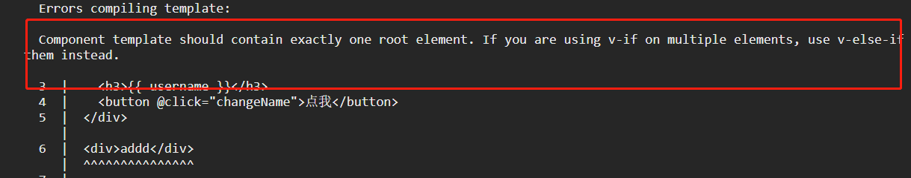

* 启用less语法，需要在style 里面增加 lang (language)

```html
<style lang="less">
    
</style>
```


## vue组件的使用方法

* script中**导入**
* 在export default 对外导出的中 **注册**components的实例

```
<template>
  <div>
    <h1>App根组件</h1>
    <div class="box">
      <Left></Left>
    </div>
  </div>
</template>

<script>
// 1. 导入需要使用的.Vue 组件
import Left from "./components/Left.vue";
export default {
  data() {},
  methods: {},
  // 在实例属性中 注册属性 注意 : 'Left' : 'Left 当键值相同时候可以进行缩写
  components: { Left },
};
</script>

<style lang="">
</style>
```


### 全局注册组件

通过components注册的组件时私有子组件，如果某个组件使用的非常频繁，可以使用全局组件。

只需要注册一次，其他组件都能直接使用。

方法：在Vue 的main.js入口文件之中，通过Vue.component()的内置方法 可以注册全局组件。注意，这是vue的构造函数生成的实例的内置方法.每个组件都共享.

```
// 导入vue包 得到vue构造函数
import Vue from 'vue'
// 导入vue.vue 组件 把app.vue 模板结构渲染到html页面之中
import App from './App.vue'
import Test from './Test.vue'
import Count from '@/components/Count.vue'
Vue.config.productionTip = false

Vue.component('MyCount', Count) // 全局注册组件


var vue = new Vue({
  // render 函数指定组件渲染到html页面之中
  render: h => h(App),
}).$mount('#app')
```


## 自定义属性props

通过注册props自定义属性，在使用模板的过程中可以使用，实现父向子传值。

* 自定义属性的步骤

1. 在组件的实例化中，声明此组件的自定义属性

```js
export default {
  props: ["init"],
  data() {
    return {
      cnt: 0,
    };
  },
};
```

2. 使用组件的时候传值即可

```
<MyCount :init="6"></MyCount>
```


* props是只读的，不建议直接修改props，而是用来传值，如下我将其初始值设为参数。

  因为所有的 prop 都使得其父子 prop 之间形成了一个**单向下行绑定**：父级 prop 的更新会向下流动到子组件中，但是反过来则不行。这样会防止从子组件意外变更父级组件的状态，从而导致你的应用的数据流向难以理解。

  额外的，每次父级组件发生变更时，子组件中所有的 prop 都将会刷新为最新的值。这意味着你**不**应该在一个子组件内部改变 prop。如果你这样做了，Vue 会在浏览器的控制台中发出警告。


* props参数的默认值 default，让props不指向数组，指向一个对象。

  * 我们先取消原参数传递

    ```js
        <MyCount></MyCount>
    ```

  * 让修改组件中props

    ```js
    export default {  props: {    init: {      default: 0,    },  },  data() {    return {      cnt: this.init,    };  },};
    ```

  * 可以发现right组件的初始值为0了

  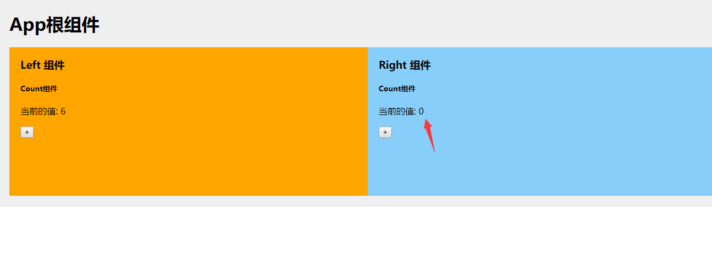

  

  

### props 验证

我们可以为组件的 prop 指定验证要求，例如你知道的这些类型。如果有一个需求没有被满足，则 Vue 会在浏览器控制台中警告你。这在开发一个会被别人用到的组件时尤其有帮助。

为了定制 prop 的验证方式，你可以为 `props` 中的值提供一个带有验证需求的对象，而不是一个字符串数组。例如：

* type： 设置传值类型
* default ： 设置默认值
* validator： 设置自定义验证函数

```js
  props: {    // 基础的类型检查 (`null` 和 `undefined` 会通过任何类型验证)    propA: Number,    // 多个可能的类型    propB: [String, Number],    // 必填的字符串    propC: {      type: String,      required: true    },    // 带有默认值的数字    propD: {      type: Number,      default: 100    },    // 带有默认值的对象    propE: {      type: Object,      // 对象或数组默认值必须从一个工厂函数获取      default: function () {        return { message: 'hello' }      }    },    // 自定义验证函数    propF: {      validator: function (value) {        // 这个值必须匹配下列字符串中的一个        return ['success', 'warning', 'danger'].indexOf(value) !== -1      }    }  }})
```


## 组件样式冲突


* 样式冲突问题

```
给某个组件增加h3 {  color: red;}
```

发现是全局的，因为把样式都统一的放到一个页面下了，会影响。


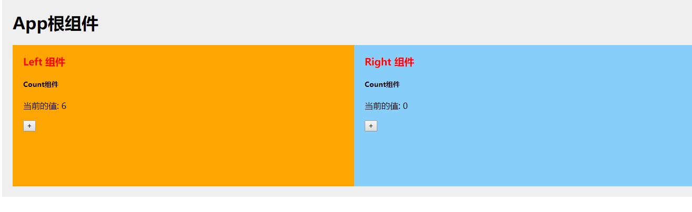

* 解决样式冲突

1. 给标签增加一个自己的特色属性，在css里面用选择器解决样式冲突

```
<template>  <div class="left-container">    <h3 zzz>Left 组件</h3>    <MyCount :init="6"></MyCount>  </div></template><script>export default {};</script><style lang="less" scopled>.left-container {  padding: 0 20px 20px;  background-color: orange;  min-height: 250px;  flex: 1;}h3[zzz]{  color: red;}</style>
```

2. 增加scoped，封锁样式域

```css
<style lang="less" scoped>.left-container {  padding: 0 20px 20px;  background-color: orange;  min-height: 250px;  flex: 1;}h3 {  color: red;}</style>
```

原理是给每个标签增加独一无二的**属性**，并且css修改对应选择器

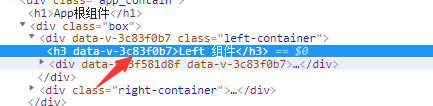


### 样式穿透

需求：假设left，right都使用了cnt，我们**只想**修改left下的元素。当是right也用了cnt组件，我们不能直接使用全局的css。

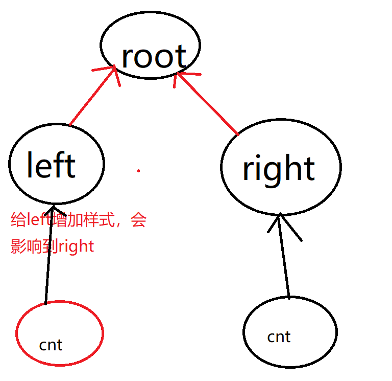


* 使用deep穿透，会让选择器前增加一个此组件的id

```cs
</script><style lang="less" scoped>.left-container {  padding: 0 20px 20px;  background-color: orange;  min-height: 250px;  flex: 1;}h3 {  color: red;}/deep/ h5 {  color: red;}</style>
```


# Vue生命周期

每个 Vue 实例在被创建时都要经过一系列的初始化过程——例如，需要设置数据监听、编译模板、将实例挂载到 DOM 并在数据变化时更新 DOM 等。同时在这个过程中也会运行一些叫做**生命周期钩子**的函数，这给了用户在不同阶段添加自己的代码的机会。

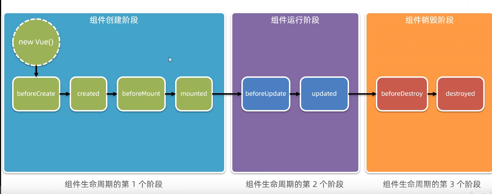

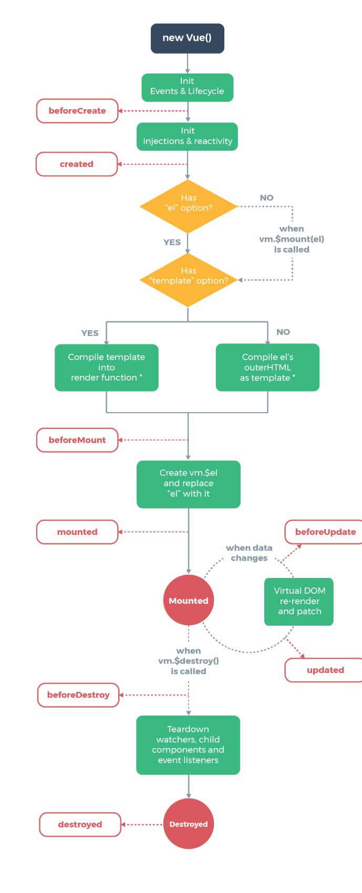

 


# 组件之间的传值

## 父向子——自定义属性

自定义属性

## 子向父——自定义事件

子组件把自己的数据，传给父组件。

* 自定义方法传值

思路

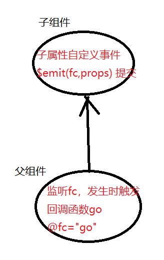

1. 子属性自定义事件

```js
this.$emit('numchange',参数);
```

2. 父组件监听事件

```js
      <Right @numchange="go"></Right>
```

3. 父组件实例定义回调函数 go

```js
go(传过来的参数) {      this.countFromSon = val;},
```

## 兄弟之间传值——EventBus

中间用一个js文件从当 EventBus，原理也是利用自定义事件的传值和监听。

```
用 $on(eventName) 监听事件使用 $emit(eventName) 触发事件
```

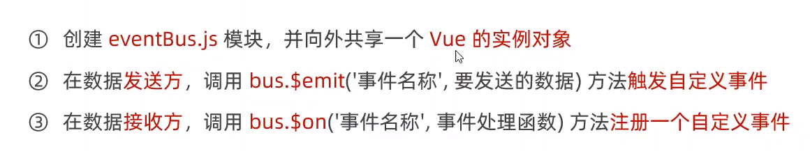

1. 创建eventBus.js 

```js
import Vue from "vue";export default new Vue();
```

2. 调用eventBug所共享的vue实例$emit事件

```js
import bus from "./eventBus.js";bus.$emit("share", this.count);
```

3. 接收方在create的时候就绑定好对应的监听事件

```js
created(){    bus.$on('share',val=>this.right=val)},
```


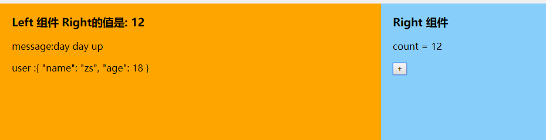


# ref引用

用ref引用来操作dom元素


* 每个vue实例组件都包含内置成员$ref 

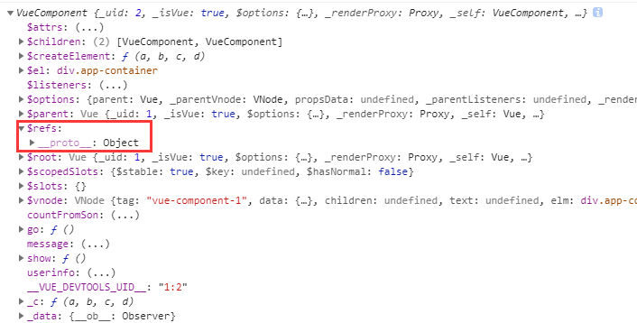


步骤

1. 给 标签/Vue组件 元素增加属性 ref 

   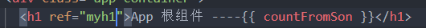

2. 调用即可

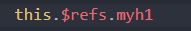


* 总结

父节点可以直接获取子节组件实例化，并且也能获取标签的dom引用。


## nextTick与ref之间的小陷阱

如果我们渲染某个元素就立刻去调用其的引用，就会报错。

原因是vue是异步进行渲染的，组件来不及更新就被调用了，自然就报错了。

需要用nextTick，会等待dom重新渲染完毕的时候就会重新执行。

```js
    <input v-if="v" @blur="v = !v" ref="inputRef" />    <button v-else @click="show()">点我展示输入框</button> show() {      this.v = !this.v;      this.$nextTick(() => this.$refs.inputRef.focus());    },
```


# 操作数组的几个函数


| 函数                                                         | 说明                                                         |
| ------------------------------------------------------------ | ------------------------------------------------------------ |
| array.forEach(function(currentValue, index, arr), thisValue) | 不支持continue和every                                        |
| array.some(function(currentValue,index,arr),thisValue)       | 找到是否存在一个，返回布尔值，有一项是true，就放回true       |
| array.every(function(currentValue,index,arr), thisValue)     | 检测每个元素是否都符合，返回布尔值，如果每项都是true 就返回true |
| array.filter(function(currentValue,index,arr), thisValue)    | 返回满足条件的，创建新的数组，不改变原数组                   |
| array.reduce(function(total, currentValue, currentIndex, arr), initialValue) | 进行累加,initialValue可选，作为初始值，total为累加变量和最后的返回值 |


# Vue 动态组件

 Vue 提供一个内置的组件component 实现组件的动态渲染

在一个多标签的界面中使用  is attribute 来切换不同的组件：

```js
<template>  <div class="app-container">    <h1>App 根组件</h1>    <br />    <div>      <button @click="comName = 'Left'">Left</button>      <button @click="comName = 'Right'">Right</button>    </div>    <div class="box">      <component :is="comName"></component>    </div>  </div></template><script>// 1. 导入需要使用的 .vue 组件import Left from "@/components/Left.vue";import Right from "@/components/Right.vue";export default {  data() {    return {      comName: Left,    };  },  // 2. 注册组件  components: {    Left: Left,    Right,  },};</script>
```


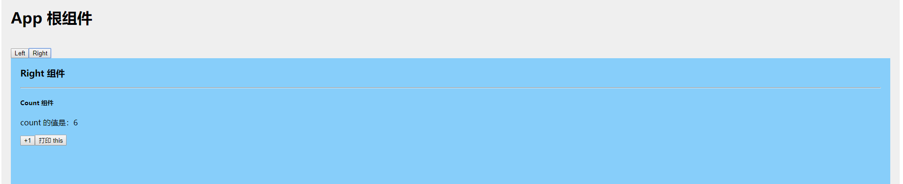


但是在切换组件的时候，之前的组件都会  

* **销毁**之前的(会触发生命周期函数的钩子)
* 创建新的实例


很明显，这样就无法保存之前组件的状态。

我们可以用一个 `<keep-alive>`元素将其动态组件包裹起来。


## keep-alive

```
<!-- 失活的组件将会被缓存！--><keep-alive>  <component v-bind:is="currentTabComponent"></component></keep-alive>
```

keep-alive 里面的component 都会被动态的缓存下来，

被缓存的组件状态为 inactive


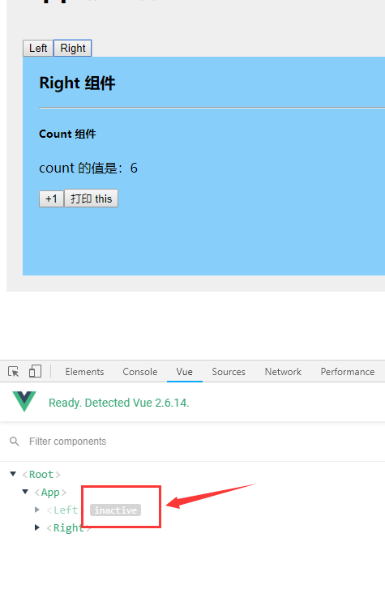


**注意这个 `<keep-alive>` 要求被切换到的组件都有自己的名字，不论是通过组件的 `name`选项还是局部/全局注册。**


## 组件的name名词

通常,我们在声明注册组件的时候没有指定name名称,则组件的名称默认就是注册时候的名称

自定义name在include的时候要用name名称.

```js
<script>export default {  name:'Myleft',}</script>
```


## include属性

原来在keep-alive里面的所有组件都会被缓存,但是有的时候不需要,因此可以用include指定某些组件被缓存.


# Vue 插槽

## 插槽的介绍

插槽(Slot)是vue为组件封装者提供的能力,允许开发者封装组件的时候,保留一定的空间,给使用组件者填充.


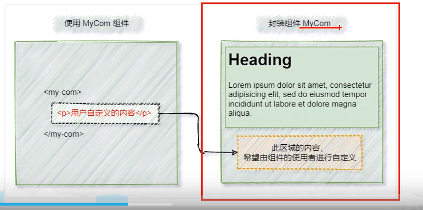


例如下列代码

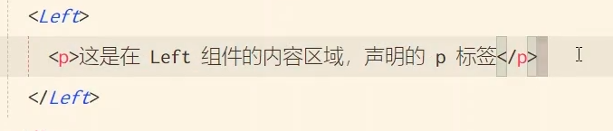

在left里面的p会被忽略,因此要在left里面设置一个插槽.

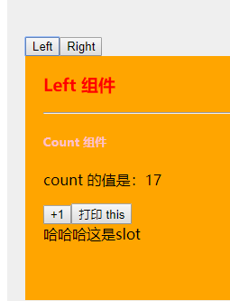


## 插槽的名称(具名插槽)

vue官方规定,每个slot插槽都要有一个name名称. 如果省略了slot的name属性,则有一个default的名称

默认情况下,我们使用组件提供的内容,都会默认填充到名字为default的插槽之中.

```js
<slot name="default"></slot>
```


## V-slot 插槽指令

* 如果我们要指定某个内容渲染到某个名字为xx的插槽之中 可以使用**v-slot:** **指令**指定对应的插槽

v-slot**必须放置到 template里面**只是一个虚拟标签,不会渲染成任何实质性的元素

```js
      <Left>        <template v-slot:插槽的名字>          <p>v-slot必须放置到 template里面</p>        </template>      </Left>
```


* v-slot: 的简写是 #

```
      <Left>        <template #xxx>          <p>v-slot必须放置到 template里面</p>        </template>      </Left>
```


## slot的默认值 --- 后备内容

如果使用者没有指定模板丢入,那么就会展示原默认内容

```
<slot name="xxx"><p>没指定的话就是我！</p></slot>
```


## 插槽运用

我们下面设置了三个插槽

```
<template>  <div class="article-container">    <!-- 标题 -->    <div class="header-box">      <slot name="header"></slot>    </div>    <!-- 内容 -->    <div class="content-box">      <slot name="content"></slot>    </div>    <!-- 作者 -->    <div class="footer-box">      <slot name="footer"></slot>    </div>  </div></template>
```


运用v-slot插槽

```html
  <Article>      <template #header>无题</template>      <template #content>床前明月光</template>      <template #footer>李白</template>    </Article>
```


效果

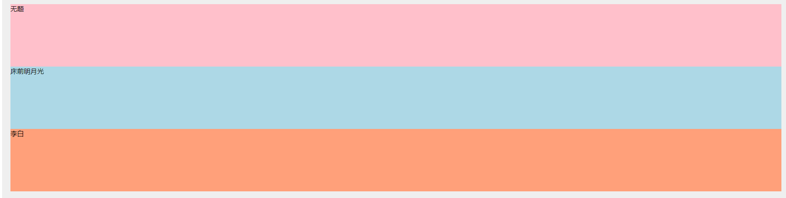


## 作用域插槽

* 作用域插槽:封装组件的时候,能给调用者一些信息使用

使用的时候也能进行解构


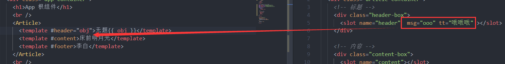

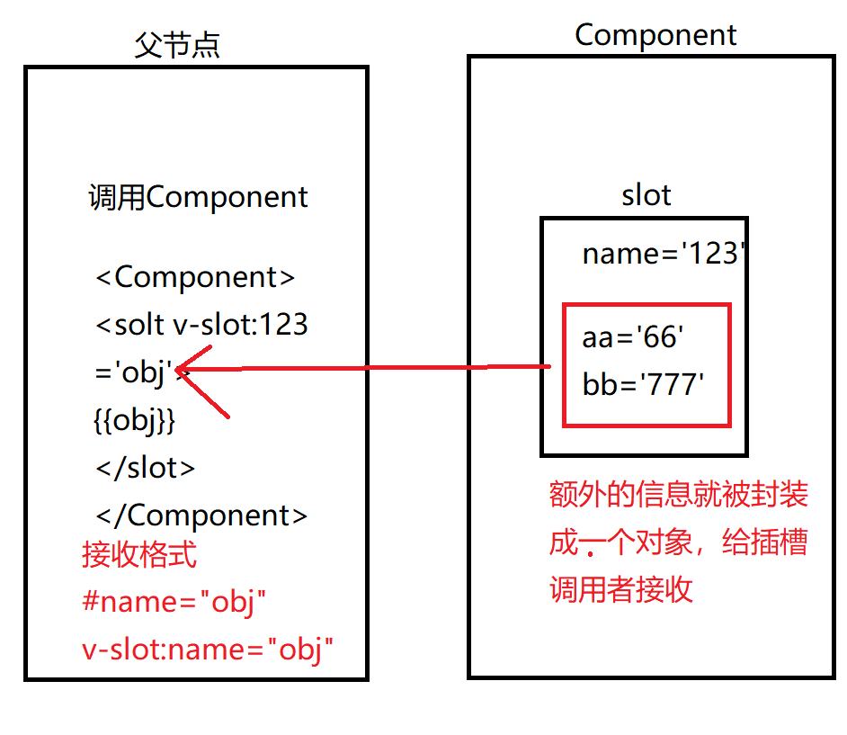


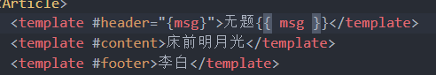

# 自定义指令

除了核心功能默认内置的指令 (`v-model` 和 `v-show`)，Vue 也允许注册自定义指令


## 自定义指令的钩子函数

- `bind`：只调用一次，指令第一次绑定到元素时调用。在这里可以进行一次性的初始化设置。
- `inserted`：被绑定元素插入父节点时调用 (仅保证父节点存在，但不一定已被插入文档中)。
- `update`：所在组件的 VNode 更新时调用，**但是可能发生在其子 VNode 更新之前**。指令的值可能发生了改变，也可能没有。但是你可以通过比较更新前后的值来忽略不必要的模板更新 (详细的钩子函数参数见下)。

- `componentUpdated`：指令所在组件的 VNode **及其子 VNode** 全部更新后调用。
- `unbind`：只调用一次，指令与元素解绑时调用。


### 钩子函数的参数

指令钩子函数会被传入以下参数：

- `el`：指令所绑定的元素，可以用来直接操作 DOM。
- `binding` ：一个对象，包含以下 property
  - `name`：指令名，不包括 `v-` 前缀。
  - `value`：指令的绑定值，例如：`v-my-directive="1 + 1"` 中，绑定值为 `2`。
  - `oldValue`：指令绑定的前一个值，仅在 `update` 和 `componentUpdated` 钩子中可用。无论值是否改变都可用。
  - `expression`：字符串形式的指令表达式。例如 `v-my-directive="1 + 1"` 中，表达式为 `"1 + 1"`。
  - `arg`：传给指令的参数，可选。例如 `v-my-directive:foo` 中，参数为 `"foo"`。
  - `modifiers`：一个包含修饰符的对象。例如：`v-my-directive.foo.bar` 中，修饰符对象为 `{ foo: true, bar: true }`。
- `vnode`：Vue 编译生成的虚拟节点。移步 [VNode API](https://cn.vuejs.org/v2/api/#VNode-接口) 来了解更多详情。
- `oldVnode`：上一个虚拟节点，仅在 `update` 和 `componentUpdated` 钩子中可用。

除了 `el` 之外，其它参数都应该是只读的，切勿进行修改。如果需要在钩子之间共享数据，建议通过元素的 [`dataset`](https://developer.mozilla.org/zh-CN/docs/Web/API/HTMLElement/dataset) 来进行。

## 私有自定义指令

```js
  // 局部自定义指令  directives: {    color: {      //里面写各种生命周期钩子      bind(el, binding) {        console.log(el);        el.style.color = binding.value;      },      inserted() {},      update() {},    },  },
```

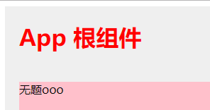


## 全局自定义指令

用实例注册

```js
// 注册一个全局自定义指令 `v-focus`Vue.directive('focus', {  // 当被绑定的元素插入到 DOM 中时……  inserted: function (el) {    // 聚焦元素    el.focus()  }})
```


# 全局导入外部库


* 导入axios

```js
import axios from "axios";Vue.prototype.axios = axios;//挂载到全局
```


* 其他组件就能直接使用

如下面代码,直接使用this.axios

```js
    async get() {      console.log(this.axios);      const { data: res } = await this.axios.get(        "http://www.liulongbin.top:3006/api/getbooks"      );      console.log(res);    },
```


# 前端路由

## 路由的概念和原理

路由( router ) 就是一个映射（对应关系）

自动实现实际地址和真实地址（对应组件）的映射


* 原理

获取锚链接的js代码 `location.hash`

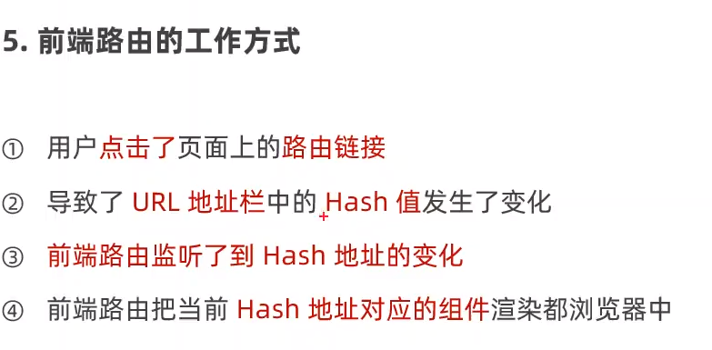


## 手动模拟前端路由

在实例创建时给window的onhashchange添加事件，利用component动态渲染组件即可。

```js
<template>  <div class="app-container">    <div class="app-top">      <h1>app根组件</h1>      <br />      <a href="#Index">首页</a>      <a href="#Movie">电影</a>      <a href="#About">关于</a>      <br />    </div>    <component :is="comName"></component>  </div></template>export default {  components: { Index, Movie, About },  data() {    return {      comName: "Index",    };  },  created() {    console.log(window);    window.onhashchange = () => {      let hash = window.location.hash;      this.comName = hash.substr(2);    };  },};
```

# vue-router 的基本使用

是vue.js给出的路由解决方案，只能在vue项目中使用。方便用于SPA单页面的模型。

## vue-router 安装配置步骤

1. 装包

```js
npm i vue-router -S
```

2. 创建路由模块：在src目录下 创建 router/index.js 的路由模块

   **index.js**

   ```js
   //1. 导包import Vue from 'vue'import VueRouter from 'vue-router'import Home from "@/components/Home.vue";import Movie from "@/components/Movie.vue";import About from "@/components/About.vue";//2. 加载插件Vue.use(VueRouter);//3. 搭建路由规则var routes = [    { path: "/home", component: Home },    { path: "/movie", component: Movie },    { path: "/about", component: About },]//4. 创建实例对象给外部使用const router = new VueRouter({    routes: routes,});//5. 向外默认共享 export default router;
   ```


3. 挂载到main.js里面的vue实例

```js
import Vue from 'vue'import App from './App2.vue'//在模块化导入的时候 如果导的是一个文件夹，就会默认导入该文件夹下的index.js文件 //所以 import router from "@/router" 也是可以的import router from '@/router/index.js'Vue.config.productionTip = falsenew Vue({  router: router,  render: h => h(App)}).$mount('#app')
```


* 官方教程

```js
// 0. 如果使用模块化机制编程，导入Vue和VueRouter，要调用 Vue.use(VueRouter)// 1. 定义 (路由) 组件。// 可以从其他文件 import 进来const Foo = { template: '<div>foo</div>' }const Bar = { template: '<div>bar</div>' }// 2. 定义路由// 每个路由应该映射一个组件。 其中"component" 可以是// 通过 Vue.extend() 创建的组件构造器，// 或者，只是一个组件配置对象。// 我们晚点再讨论嵌套路由。const routes = [  { path: '/foo', component: Foo },  { path: '/bar', component: Bar }]// 3. 创建 router 实例，然后传 `routes` 配置// 你还可以传别的配置参数, 不过先这么简单着吧。const router = new VueRouter({  routes // (缩写) 相当于 routes: routes})// 4. 创建和挂载根实例。// 记得要通过 router 配置参数注入路由，// 从而让整个应用都有路由功能const app = new Vue({  router}).$mount('#app')// 现在，应用已经启动了！
```

## vue router组件

* router-view : vue-router的一个占位符代替component
* router-link：替代普通的a链接进行跳转

## 前端页面写法

* \<a>写法

```js
<template>  <div class="app-container">    <div class="app-top">      <h1>app根组件</h1>      <br />      <a href="#/home">首页</a>      <a href="#/movie">电影</a>      <a href="#/about">关于</a>      <br />      <router-view></router-view>    </div>  </div></template>
```

* router-link

```js
<template>  <div class="app-container">    <div class="app-top">      <h1>app根组件</h1>      <br />      <router-link to="/home">首页</router-link>      <router-link to="/movie">电影</router-link>      <router-link to="/about">关于</router-link>      <br />      <router-view></router-view>    </div>  </div></template>
```

从下图可以发现 router-view 的本质也是 a链接

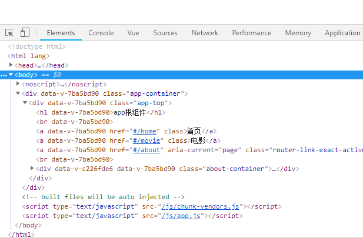


## 路由重定向

访问地址A的时候，可以把请求**重定向**（区分转发）导地址B里。

```js
//重定向var routes = [    { path: "/", redirect: '/home' },    { path: "/home", component: Home },]
```


## 嵌套(子)路由

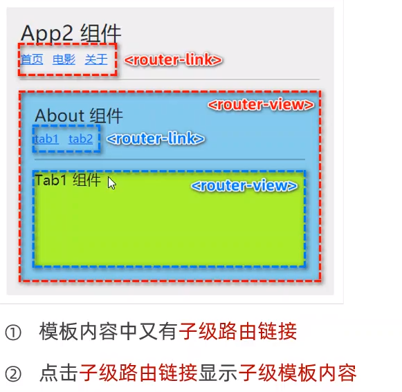

**关于**本身就是一个路由，但是关于里面又tab1和tab2，又有子集路由

### 子路由规则写法


* 注意：子路由数组里的的规则不能以/开头 **以 `/` 开头的嵌套路径会被当作根路径。 这让你充分的使用嵌套组件而无须设置嵌套的路径。******

```js
var routes = [    { path: "/", redirect: '/home' },    { path: "/home", component: Home },    { path: "/movie", component: Movie },    {        path: "/about", component: About, children: [            { path: "tab1", component: Tab1 },            { path: "tab2", component: Tab2 },        ]    },]
```


### 默认子路由

如果children数组中，某个路由规则的path为空字符串，则这条规则叫做默认子路由

下面代码：一进入about就默认使用tab1

```js
    {        path: "/about",        component: About,        children: [            { path: "", component: Tab1 },            { path: "tab2", component: Tab2 },        ]    },
```


## 动态路由规则

当不同的id值，都指向同一个组件时候，添加多个路由规则就让代码复用性很差。

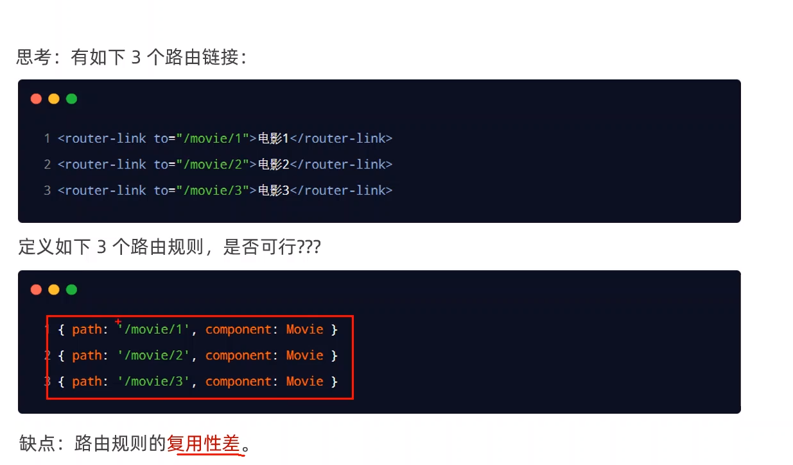


* 解决方案——动态路由规则

利用:开头的字符来表示此级的地址路由规则是动态的，并且id值为id

```js
<router-link to="/movie/1">电影1</router-link><router-link to="/movie/2">电影2</router-link><router-link to="/movie/3">电影3</router-link>routes{ path: "/movie/:id", component: Movie },     
```

* 获取动态id的值


现在呢，像 `/movie/1 和 /movie/2` 都将映射到相同的路由。

一个“路径参数”使用冒号 `:` 标记。当匹配到一个路由时，参数值会被设置到 `this.$route.params`，可以在每个组件内使用。于是，我们可以更新 `User` 的模板，输出当前用户的 ID：

```js
const User = {  template: '<div>User {{ $route.params.id }}</div>'}
```

* $route 是路由的参数对象 （注：$router是导航对象）

你可以在一个路由中设置多段“路径参数”，对应的值都会设置到 `$route.params` 中。例如：

| 模式                          | 匹配路径            | $route.params                          |
| ----------------------------- | ------------------- | -------------------------------------- |
| /user/:username               | /user/evan          | `{ username: 'evan' }`                 |
| /user/:username/post/:post_id | /user/evan/post/123 | `{ username: 'evan', post_id: '123' }` |

除了 `$route.params` 外，`$route` 对象还提供了其它有用的信息，例如，

* `$route.query` (如果 URL 中有查询参数)
* `$route.hash` #后面的东西
* `$route.fullpath` 全路径

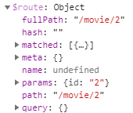

我们地址为

```
http://localhost:8080/#/movie/2?a=1&b=2
```

query就会解析url之中的查询参数。

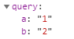


## 路由规则props传参

动态路由规则能够携带参数，可以开启props进行传参，让路由所对应的组件通过props获取路由规则的动态参数

```js
    { path: "/movie/:id", component: Movie,props:true},            export default {          name: "Movie",          // 接收 props 数据          props: ["mid"],    }
```


## 路径参数和url查询参数

* 在hash地址中，叫做“路径参数”。如：`/movie/1`

* 查询参数是url的最后?后面的参数项


## 路由导航

* 声明式导航：在浏览器中，通过点击链接实现导航方式叫声明式导航。如：router-link  a 链接
* 编程式导航：调用API方法实现导航，如 location.href 

在vue-router 里面也有一定的方法来代替原来的js方法

**$router**为导航对象

1. `this.$router.push(‘hash地址’)` 会增加一条历史记录（可以后退）

2. `this.$router.replace('hash地址')` 跳转到指定hash地址，替换掉当前的历史记录

3. `this.$router.go(整数)` 可以进行前进和后退 如-1代表后退一个 +1代表前进一个

   实际开发vue提供了便捷的方法 

   * `this.$router.forward()`前进一个
   * `this.$router.back()`后退一层


## 导航守卫

顾名思义，可以控制路由的访问权限

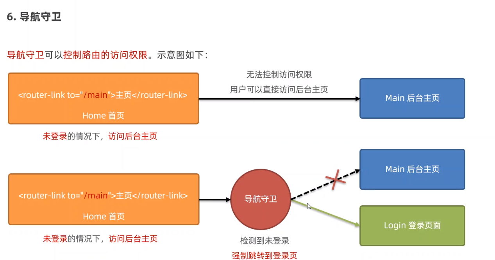


## 全局前置守卫	

**全局前置守卫**：在跳转之前触发回调函数

```js
//实例对象给外部使用
const router = new VueRouter({ routes: routes, });
//全局导航守卫
//to 代表目的路由参数对象
//from 代表当前位置的路由参数对象
//next 是函数变量 next() 代表放行
router.beforeEach((to, from, next) => {
  console.log(to); console.log(from); next()
});
```

* `next()`的调用方式

1. `next()`直接放行
2. `next('hash')`地址 转发到这个页面
3. `  next(false);` 中断当前导航
4. `next(error)` (2.4.0+) 如果传入 `next` 的参数是一个 `Error` 实例，则导航会被终止且该错误会被传递给 [`router.onError()`](https://router.vuejs.org/zh/api/#router-onerror) 注册过的回调。


